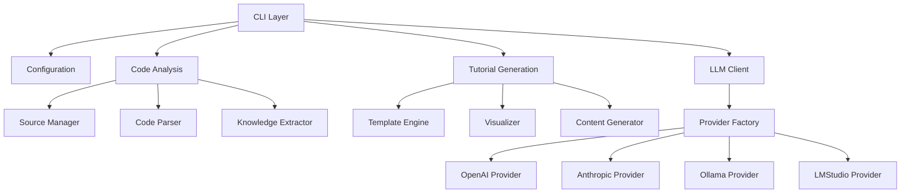
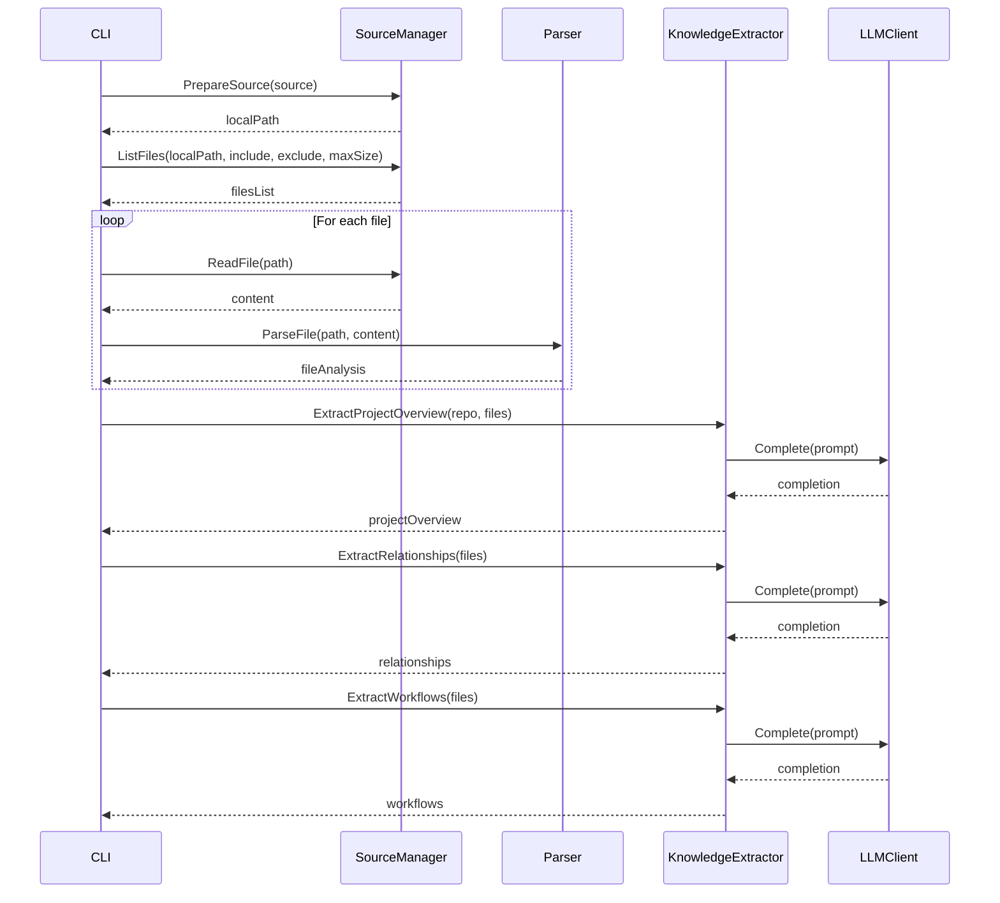
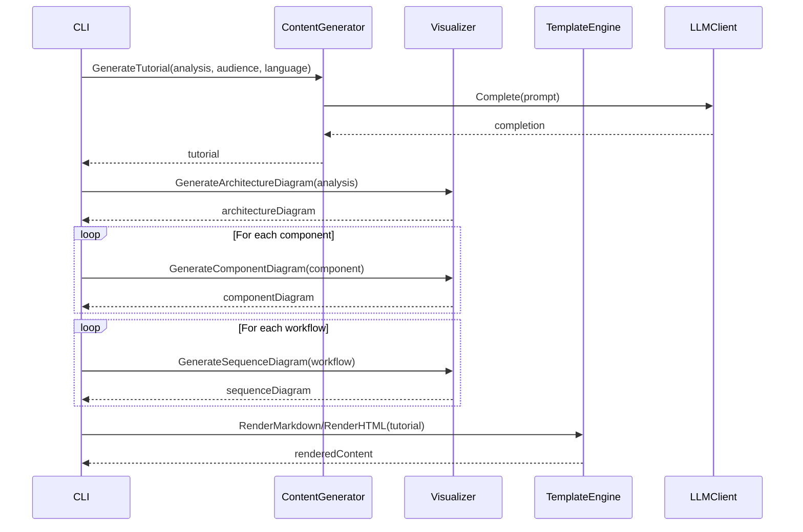

<!--
Copyright (c) 2025 Kayvan Sylvan

This source code is licensed under the MIT license found in the
LICENSE file in the root directory of this source tree.
-->

# Code-Decoder Architecture

This document outlines the architecture for the `code-decoder` project, an AI-powered codebase tutorial generator. The architecture is designed to be modular, maintainable, and follows Go project best practices.

## 1. High-Level Architecture

The Code-Decoder system is organized into the following major components:



### 1.1 Core Components

1. **CLI Layer**: Entry point for the application, handling command-line arguments and orchestrating the workflow.
2. **Configuration**: Manages configuration from files, environment variables, and command-line flags.
3. **Code Analysis**: Handles repository/directory analysis and knowledge extraction.
4. **Tutorial Generation**: Creates audience-targeted tutorials with appropriate visualizations.
5. **LLM Client**: Provides a unified interface for interacting with different LLM providers.

## 2. Detailed Component Design

### 2.1 Project Structure

```plaintext
code-decoder/
├── cmd/                   # Application entry points
│   └── code-decoder/      # Main CLI application
├── internal/              # Private application code
│   ├── analysis/          # Code analysis components
│   ├── config/            # Configuration management
│   ├── generation/        # Tutorial generation
│   ├── llm/               # LLM provider interfaces and implementations
│   └── util/              # Shared utilities
├── pkg/                   # Public libraries that can be imported by other projects
│   ├── model/             # Core data models
│   ├── parser/            # Language-specific code parsers
│   └── visualizer/        # Visualization generators
├── templates/             # Output templates
├── assets/                # Static assets
│   └── images/            # Images for documentation
└── docs/                  # Documentation
```

### 2.2 CLI Layer

The CLI layer is implemented using Cobra, providing a structured command interface with subcommands for analysis, generation, and testing LLM connections.

```go
// Example CLI structure
func NewRootCommand() *cobra.Command {
    rootCmd := &cobra.Command{
        Use:   "code-decoder",
        Short: "AI-Powered Codebase Tutorial Generator",
    }

    rootCmd.AddCommand(
        NewAnalyzeCommand(),
        NewGenerateCommand(),
        NewTestLLMCommand(),
    )

    return rootCmd
}
```

### 2.3 Configuration Module

The Configuration module handles loading and validating configuration from multiple sources with a clear precedence order:

1. Command-line flags (highest priority)
2. Environment variables
3. Configuration file in current directory
4. Configuration file in user's home directory (lowest priority)

```go
type Config struct {
    LLM      LLMConfig      `yaml:"llm"`
    Defaults DefaultsConfig `yaml:"defaults"`
    GitHub   GitHubConfig   `yaml:"github"`
}

type LLMConfig struct {
    Provider string `yaml:"provider"`
    APIKey   string `yaml:"api_key"`
    Model    string `yaml:"model"`
    Endpoint string `yaml:"endpoint"`
}

// Additional config structs...
```

### 2.4 Code Analysis Module

#### 2.4.1 Source Manager

Handles repository cloning, local directory access, and file filtering:

```go
type SourceManager interface {
    // Fetch a repository or validate a local directory
    PrepareSource(source string, isRepo bool) (string, error)

    // List files based on include/exclude patterns
    ListFiles(dir string, include, exclude []string, maxSize int64) ([]string, error)

    // Read file contents
    ReadFile(path string) ([]byte, error)
}
```

#### 2.4.2 Code Parser

Extracts structural information from source code:

```go
type Parser interface {
    // Parse a single file and return its structure
    ParseFile(path string, content []byte) (*model.FileAnalysis, error)

    // Determine the file's language
    DetectLanguage(filename string) string
}
```

#### 2.4.3 Knowledge Extractor

Uses LLM to extract high-level knowledge from code:

```go
type KnowledgeExtractor interface {
    // Extract high-level project information
    ExtractProjectOverview(repo string, files []*model.FileAnalysis) (*model.ProjectOverview, error)

    // Extract component relationships
    ExtractRelationships(files []*model.FileAnalysis) ([]*model.Relationship, error)

    // Extract workflow information
    ExtractWorkflows(files []*model.FileAnalysis) ([]*model.Workflow, error)
}
```

### 2.5 LLM Client Module

#### 2.5.1 Provider Interface

Common interface for all LLM providers:

```go
type Provider interface {
    // Initialize the provider with configuration
    Initialize(config ProviderConfig) error

    // Send a completion request to the LLM
    Complete(ctx context.Context, prompt string, options CompletionOptions) (string, error)

    // Test the connection to the provider
    TestConnection(ctx context.Context) error
}
```

#### 2.5.2 Provider Factory

Creates appropriate LLM provider instances:

```go
func NewProvider(providerName string) (Provider, error) {
    switch providerName {
    case "openai":
        return &OpenAIProvider{}, nil
    case "anthropic":
        return &AnthropicProvider{}, nil
    case "ollama":
        return &OllamaProvider{}, nil
    case "lmstudio":
        return &LMStudioProvider{}, nil
    default:
        return nil, fmt.Errorf("unsupported provider: %s", providerName)
    }
}
```

### 2.6 Tutorial Generation Module

#### 2.6.1 Content Generator

Creates tutorial content based on analysis results and audience:

```go
type ContentGenerator interface {
    // Generate tutorial content for the specified audience
    GenerateTutorial(analysis *model.CodebaseAnalysis, audience, language string) (*model.Tutorial, error)

    // Generate code examples with explanations
    GenerateExamples(analysis *model.CodebaseAnalysis, audience string) ([]*model.Example, error)
}
```

#### 2.6.2 Template Engine

Renders tutorials using templates:

```go
type TemplateEngine interface {
    // Render tutorial to Markdown
    RenderMarkdown(tutorial *model.Tutorial) (string, error)

    // Render tutorial to HTML
    RenderHTML(tutorial *model.Tutorial) (string, error)
}
```

#### 2.6.3 Visualizer

Creates visualizations for the tutorial:

```go
type Visualizer interface {
    // Generate architecture diagram
    GenerateArchitectureDiagram(analysis *model.CodebaseAnalysis) (string, error)

    // Generate component diagram
    GenerateComponentDiagram(components []*model.Component) (string, error)

    // Generate sequence diagram
    GenerateSequenceDiagram(workflow *model.Workflow) (string, error)
}
```

## 3. Core Data Models

### 3.1 Analysis Models

```go
type CodebaseAnalysis struct {
    ProjectName    string
    ProjectOverview *ProjectOverview
    Files          []*FileAnalysis
    Components     []*Component
    Relationships  []*Relationship
    Workflows      []*Workflow
}

type FileAnalysis struct {
    Path        string
    Language    string
    Imports     []string
    Declarations []*Declaration
    Content     string // Original content or summary
}

// Additional model structures...
```

### 3.2 Tutorial Models

```go
type Tutorial struct {
    Title            string
    Introduction     string
    TableOfContents  []TOCEntry
    Sections         []Section
    Examples         []Example
    Visualizations   []Visualization
    Conclusion       string
}

// Additional model structures...
```

## 4. Control Flow

### 4.1 Analysis Workflow



### 4.2 Generation Workflow



## 5. Error Handling Strategy

Code-Decoder uses a consistent error handling approach:

1. **Domain-specific errors**: Define error types for different domains
2. **Error wrapping**: Use `fmt.Errorf("context: %w", err)` to add context
3. **Error chains**: Create error chains for complex workflows
4. **User-friendly messages**: Convert technical errors to user-friendly messages

```go
// Example error definitions
var (
    ErrConfigNotFound    = errors.New("configuration file not found")
    ErrInvalidRepository = errors.New("invalid repository URL")
    ErrLLMUnavailable    = errors.New("LLM provider unavailable")
)

// Example error handling
func ProcessFile(path string) error {
    content, err := ioutil.ReadFile(path)
    if err != nil {
        return fmt.Errorf("failed to read file %s: %w", path, err)
    }

    // Process the file...
    return nil
}
```

## 6. Testing Strategy

### 6.1 Unit Testing

Each component should have comprehensive unit tests:

```go
func TestParseGoFile(t *testing.T) {
    // Test setup
    parser := NewGoParser()
    content := []byte(`package main

func main() {
    fmt.Println("Hello, world!")
}`)

    // Test execution
    analysis, err := parser.ParseFile("test.go", content)

    // Test assertions
    assert.NoError(t, err)
    assert.Equal(t, "main", analysis.Package)
    assert.Len(t, analysis.Functions, 1)
    assert.Equal(t, "main", analysis.Functions[0].Name)
}
```

### 6.2 Integration Testing

Test the interaction between multiple components:

```go
func TestAnalyzeLocalRepository(t *testing.T) {
    // Test setup
    tempDir := createTestRepository(t)
    defer os.RemoveAll(tempDir)

    // Test execution
    analyzer := NewAnalyzer(testConfig)
    analysis, err := analyzer.AnalyzeLocalRepository(tempDir)

    // Test assertions
    assert.NoError(t, err)
    assert.NotNil(t, analysis)
    assert.Equal(t, "test-project", analysis.ProjectName)
    // Further assertions...
}
```

### 6.3 Mocking

Use interfaces and mocks for testing components in isolation:

```go
type MockLLMProvider struct {
    mock.Mock
}

func (m *MockLLMProvider) Complete(ctx context.Context, prompt string, options CompletionOptions) (string, error) {
    args := m.Called(ctx, prompt, options)
    return args.String(0), args.Error(1)
}

// Example test with mock
func TestKnowledgeExtractor(t *testing.T) {
    mockProvider := new(MockLLMProvider)
    mockProvider.On("Complete", mock.Anything, mock.Anything, mock.Anything).Return("Mocked response", nil)

    extractor := NewKnowledgeExtractor(mockProvider)
    // Test the extractor...
}
```

## 7. Performance Considerations

1. **Parallel Processing**: Use goroutines and sync primitives to process files concurrently:

   ```go
   func AnalyzeFiles(files []string) []*FileAnalysis {
       results := make([]*FileAnalysis, len(files))
       var wg sync.WaitGroup
       sem := make(chan struct{}, runtime.NumCPU())

       for i, file := range files {
           wg.Add(1)
           sem <- struct{}{}

           go func(idx int, filePath string) {
               defer wg.Done()
               defer func() { <-sem }()

               results[idx] = analyzeFile(filePath)
           }(i, file)
       }

       wg.Wait()
       return results
   }
   ```

2. **Batch Processing**: Group related LLM requests to minimize API calls:

   ```go
   func BatchAnalyze(files []*FileAnalysis, batchSize int) []*ComponentAnalysis {
       // Process files in batches
       batches := splitIntoBatches(files, batchSize)
       var results []*ComponentAnalysis

       for _, batch := range batches {
           batchResults := processFileBatch(batch)
           results = append(results, batchResults...)
       }

       return results
   }
   ```

3. **Caching**: Cache expensive operations:

   ```go
   type Cache interface {
       Get(key string) (interface{}, bool)
       Set(key string, value interface{})
   }

   // Example usage
   func (e *KnowledgeExtractor) ExtractProjectOverview(files []*FileAnalysis) (*ProjectOverview, error) {
       cacheKey := generateCacheKey(files)

       if cached, ok := e.cache.Get(cacheKey); ok {
           return cached.(*ProjectOverview), nil
       }

       // Perform extraction...
       overview := performExtraction(files)

       e.cache.Set(cacheKey, overview)
       return overview, nil
   }
   ```

## 8. Security Considerations

1. **API Key Management**: Store API keys securely:

   ```go
   func loadAPIKey(config *Config) (string, error) {
       // Try environment variable first
       if key := os.Getenv("CODE_DECODER_API_KEY"); key != "" {
           return key, nil
       }

       // Try config file
       if config.LLM.APIKey != "" {
           return config.LLM.APIKey, nil
       }

       // Try keyring as a fallback
       key, err := keyring.Get("code-decoder", "api-key")
       if err == nil {
           return key, nil
       }

       return "", ErrAPIKeyNotFound
   }
   ```

2. **Network Security**: Use secure connections for API calls:

   ```go
   func newHTTPClient() *http.Client {
       return &http.Client{
           Transport: &http.Transport{
               TLSClientConfig: &tls.Config{
                   MinVersion: tls.VersionTLS12,
               },
               // Additional security settings...
           },
       }
   }
   ```

3. **Code Sanitization**: Sanitize code snippets before sending to LLMs:

   ```go
   func sanitizeCodeForLLM(code string) string {
       // Remove potential secrets
       code = secretPattern.ReplaceAllString(code, "API_KEY_REDACTED")

       // Remove other sensitive data
       // ...

       return code
   }
   ```

## 9. Extensibility

### 9.1 Adding New LLM Providers

To add a new LLM provider, implement the `Provider` interface:

```go
// Define the new provider
type NewProvider struct {
    client *newprovider.Client
    // Additional fields...
}

// Implement the Provider interface
func (p *NewProvider) Initialize(config ProviderConfig) error {
    // Initialize the provider-specific client
    p.client = newprovider.NewClient(config.APIKey)
    return nil
}

func (p *NewProvider) Complete(ctx context.Context, prompt string, options CompletionOptions) (string, error) {
    // Implement provider-specific completion logic
    resp, err := p.client.GenerateCompletion(ctx, &newprovider.CompletionRequest{
        Prompt:     prompt,
        MaxTokens:  options.MaxTokens,
        // Map other options...
    })
    if err != nil {
        return "", fmt.Errorf("new provider completion failed: %w", err)
    }

    return resp.Text, nil
}

func (p *NewProvider) TestConnection(ctx context.Context) error {
    // Implement connection test logic
    return p.client.Ping(ctx)
}

// Register the new provider in the factory
func init() {
    RegisterProvider("newprovider", func() Provider {
        return &NewProvider{}
    })
}
```

### 9.2 Adding New Language Support

Support for new programming languages can be added by implementing the `Parser` interface:

```go
// Define the new language parser
type NewLanguageParser struct {
    // Parser-specific fields...
}

// Implement the Parser interface
func (p *NewLanguageParser) ParseFile(path string, content []byte) (*model.FileAnalysis, error) {
    // Implement language-specific parsing logic
    // ...
}

func (p *NewLanguageParser) DetectLanguage(filename string) string {
    // Determine if this parser can handle the file
    if strings.HasSuffix(filename, ".ext") {
        return "newlanguage"
    }
    return ""
}

// Register the parser
func init() {
    RegisterParser(".ext", func() Parser {
        return &NewLanguageParser{}
    })
}
```

### 9.3 Custom Output Formats

Add support for new output formats by extending the `TemplateEngine`:

```go
// Add a new renderer method
func (t *TemplateEngine) RenderCustomFormat(tutorial *model.Tutorial) (string, error) {
    // Implement custom format rendering logic
    template, err := t.loadTemplate("custom_format.tmpl")
    if err != nil {
        return "", err
    }

    var buffer bytes.Buffer
    if err := template.Execute(&buffer, tutorial); err != nil {
        return "", err
    }

    return buffer.String(), nil
}
```

## 10. Deployment and Distribution

### 10.1 Binary Distribution

Build binaries for multiple platforms using Go's cross-compilation capabilities:

```bash
# Build for multiple platforms
GOOS=darwin GOARCH=amd64 go build -o dist/code-decoder-darwin-amd64 ./cmd/code-decoder
GOOS=linux GOARCH=amd64 go build -o dist/code-decoder-linux-amd64 ./cmd/code-decoder
GOOS=windows GOARCH=amd64 go build -o dist/code-decoder-windows-amd64.exe ./cmd/code-decoder
```

### 10.2 Docker Deployment

Provide a Docker image for containerized usage:

```dockerfile
FROM golang:1.21-alpine AS builder

WORKDIR /app
COPY . .
RUN go mod download
RUN go build -o code-decoder ./cmd/code-decoder

FROM alpine:latest

WORKDIR /root
COPY --from=builder /app/code-decoder /usr/local/bin/
COPY --from=builder /app/templates /etc/code-decoder/templates

ENTRYPOINT ["code-decoder"]
```

## 11. Conclusion

The architecture described in this document provides a solid foundation for the Code-Decoder project. It follows Go best practices with a clean separation of concerns, well-defined interfaces, and a modular design that enables easy maintenance and extension.

Key strengths of this architecture include:

1. **Modularity**: Components can be developed, tested, and modified independently.
2. **Extensibility**: New LLM providers, programming languages, and output formats can be added easily.
3. **Scalability**: Parallel processing and efficient resource management for handling large codebases.
4. **Maintainability**: Clear separation of responsibilities and well-defined interfaces.
5. **Testability**: Interface-driven design facilitates comprehensive testing with mocks.

By implementing this architecture, the Code-Decoder project will be well-positioned to meet its requirements and deliver value to users across different expertise levels while maintaining flexibility for future enhancements.
